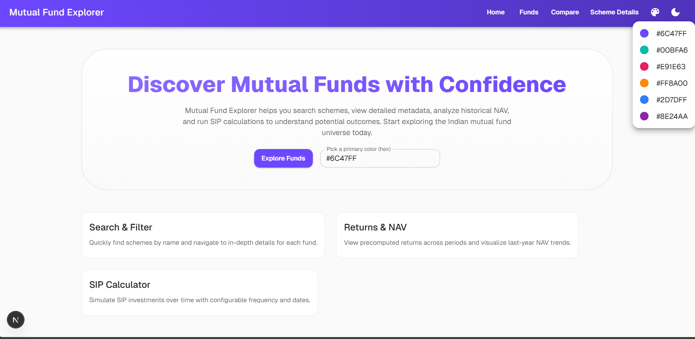
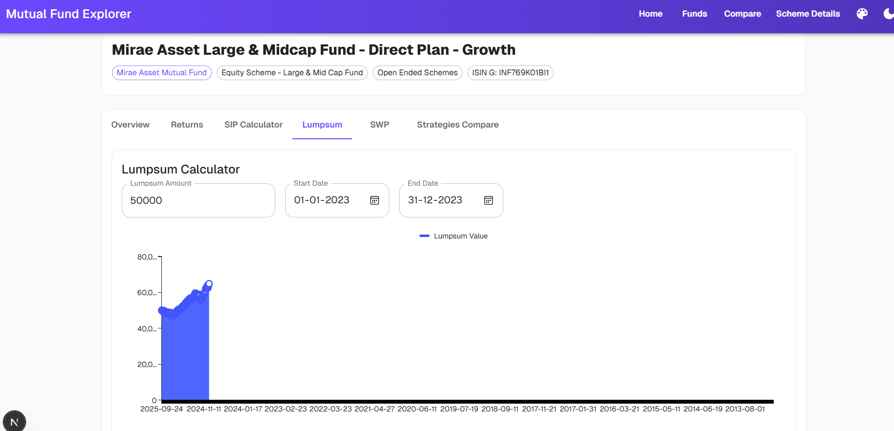

## Mutual Fund Explorer

A Next.js app to explore Indian mutual funds: search schemes, view metadata, analyze NAV and returns, and run SIP/Lumpsum/SWP simulations. It includes a theme system with color and mode switching, and a Fund Comparison Tool.

### Tech
- Next.js 15 (App Router) with Turbopack
- MUI v7 (with Emotion)
- Charting: `@mui/x-charts`
- APIs: Next.js route handlers under `src/app/api`

---

## Setup & Running

1) Install dependencies
```bash
npm install
```

2) Run dev server
```bash
npm run dev
```

3) Open `http://localhost:3000`

Environment: no special env vars required for local.

---

## Features

### Theming & UX
- Theme color picker (NavBar menu and on Home/Funds pages)
- Light/Dark mode toggle
- Consistent, modern MUI styling (rounded cards, gradients, soft borders)

### Navigation
- Home, Funds, Scheme Detail, Compare (Fund Comparison Tool)

### Funds
- Search with autocomplete-like filtering
- Professional cards (avatar, title, metadata chips), responsive 1/2/3 per row
- Smooth hover and quick link to scheme page

### Scheme Detail
- Overview tab with NAV (last year), area fill, optional Moving Average (configurable window)
- Returns tab with pre-computed table
- SIP Calculator tab
- Lumpsum Calculator tab
- SWP (Systematic Withdrawal Plan) tab
- Strategies Compare tab: overlays SIP vs Lumpsum vs SWP
- Branded loader while data loads

### Fund Comparison Tool (`/compare`)
- Select multiple schemes to compare
- NAV trend overlay (last year)
- Metadata table (fund house, type, category)
- Risk vs Return scatter (volatility vs average return)

---

## Screenshots

Place the images below in `public/screenshots/`. If your filenames differ, either rename them or update the paths here.

### Home


### Funds


### Global Loader


### Compare


### Scheme – Overview


### Scheme – Returns


### Scheme – Lumpsum


### Scheme – SIP


### Scheme – SWP


### Scheme – Strategies Compare


---

## Project Structure
```
src/
  app/
    page.js                # Home
    funds/page.js          # Funds list
    scheme/[code]/page.js  # Scheme detail tabs
    compare/page.js        # Fund comparison tool
    api/...                # Data endpoints
  components/
    NavBar.js
    ThemeProviderClient.js
    NavColorControl.js
    BrandedLoader.js
```

---

## Notes
- Theme preferences are persisted in localStorage (`mf-primary`, `mf-mode`).
- Data is fetched from internal API routes.
- Risk metric in Compare is a simple daily NAV return volatility over recent points; refine as needed.

---

## Deploy
Follow Next.js deployment guides or Vercel. After deploy, ensure APIs are accessible and screenshots paths are updated.
